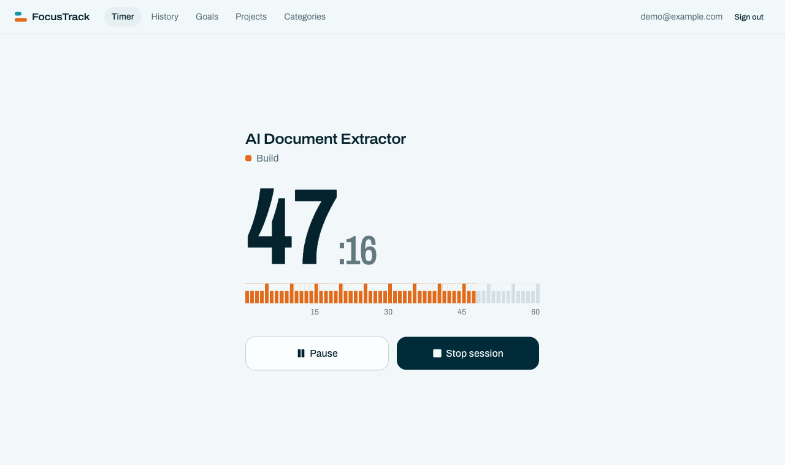
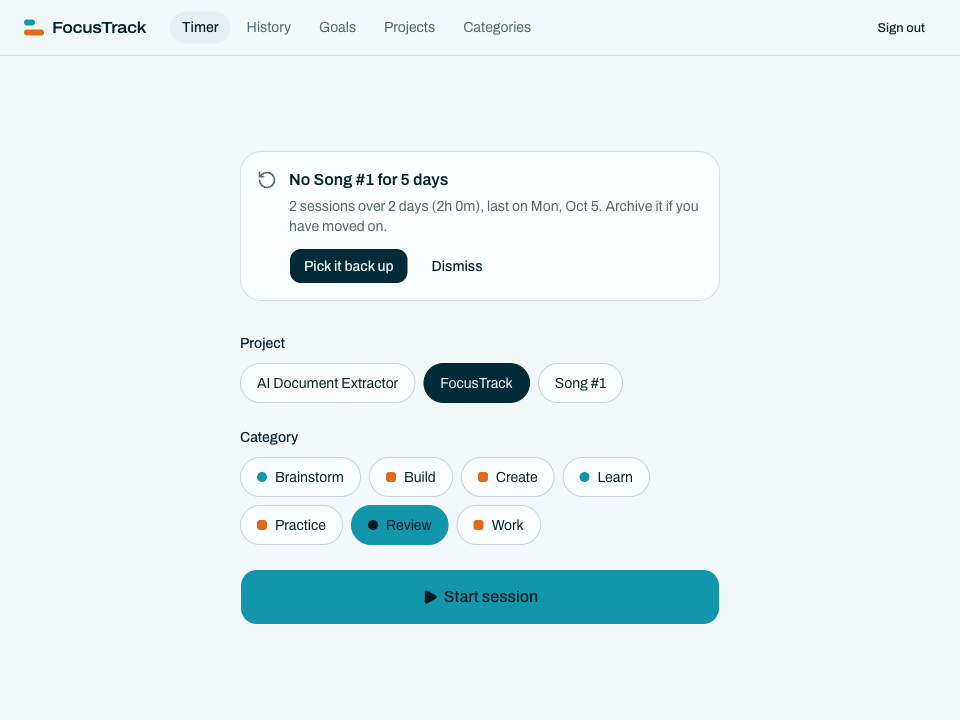
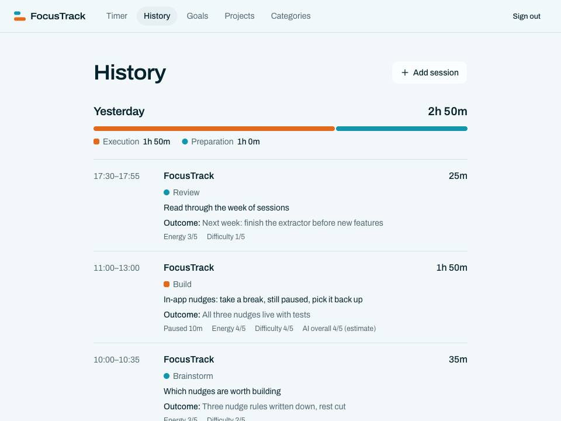
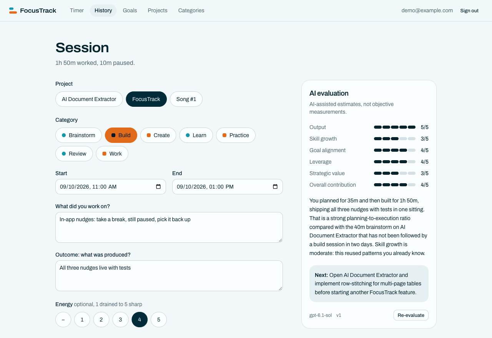

# FocusTrack

A personal work tracker that answers one question:

> Am I using my time well, and am I turning my thinking into meaningful execution?

It tracks work sessions and what each one produced. It is not a todo app, a habit tracker, or a journal.

**[Open the app](https://focustrack-taupe.vercel.app)**

<p align="center">
  
</p>

## What it does

- **Timer.** Pick a project and a category, start, pause, stop.
- **Session log.** Every session records what you worked on and what it produced.
- **Execution vs preparation.** Each category is one or the other, so history shows how much of a day went to building and how much to getting ready to build.
- **Goals and projects.** Projects roll up to the long-term goals they serve.
- **Nudges.** Computed from your own sessions, shown in the app only: take a break, still paused, pick a lapsed project back up.
- **AI evaluation (optional).** Scores a session and suggests one concrete next action. Everything else works without it.

| Start a session | History |
|---|---|
|  |  |

<p align="center">
  
</p>

<sub>Screenshots show demo data.</sub>

## Stack

Next.js (App Router), TypeScript, Tailwind CSS, shadcn/ui, Supabase (Postgres, Auth, Row Level Security), deployed on Vercel.

## Run locally

Needs Node 24, pnpm, and Docker.

```bash
# Database: starts local Supabase and prints the API URL and publishable key
cd backend
pnpm install
pnpm start

# App
cd ../frontend
pnpm install
cp .env.example .env.local   # fill in the URL and key from above
pnpm dev                     # http://localhost:3000
```

Set `OPENAI_API_KEY` in `.env.local` to turn on AI evaluation.

## Test

```bash
cd frontend && pnpm test   # unit tests
cd backend && pnpm test    # database and RLS tests
```

## Deploy

Pushing to `main` runs [the deploy workflow](.github/workflows/deploy.yml): typecheck, lint, tests, then a production deploy to Vercel. Database migrations are applied separately with `pnpm db:push` from `backend/`.

## More

- [PLAN.md](PLAN.md): product spec and build plan
- [CLAUDE.md](CLAUDE.md): architecture, conventions, and working rules
