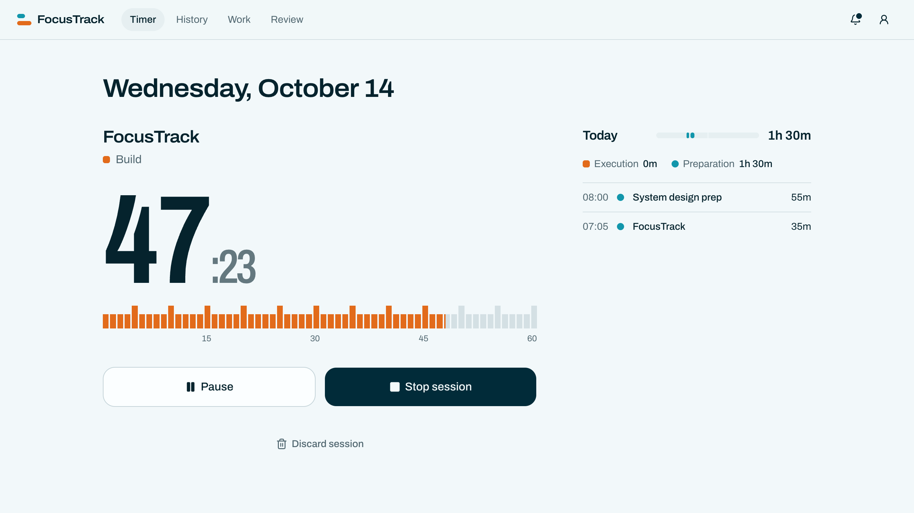
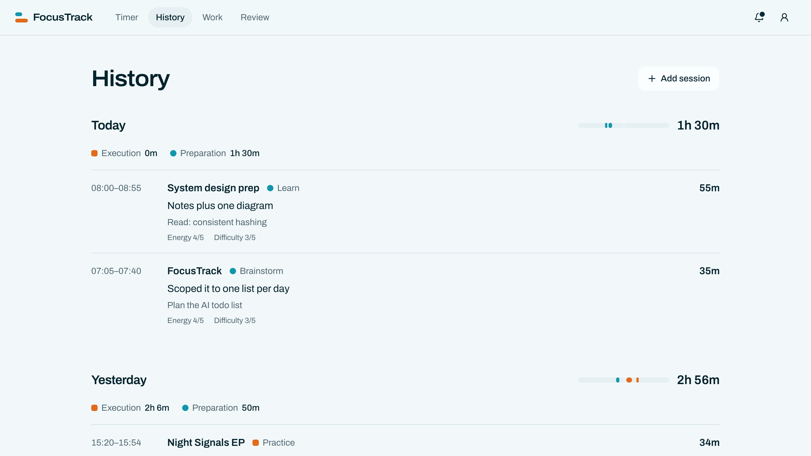
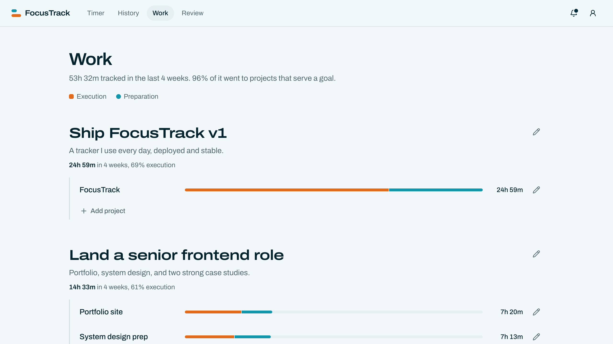
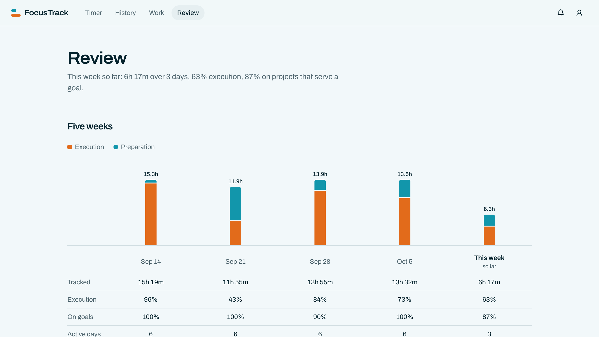
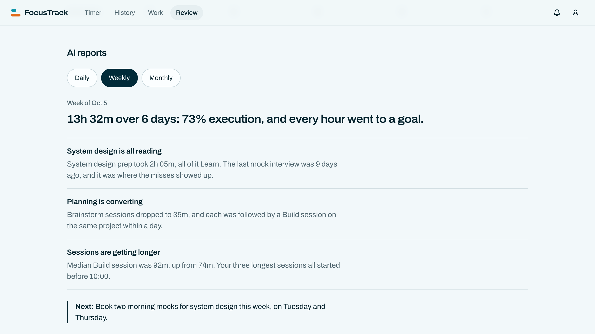
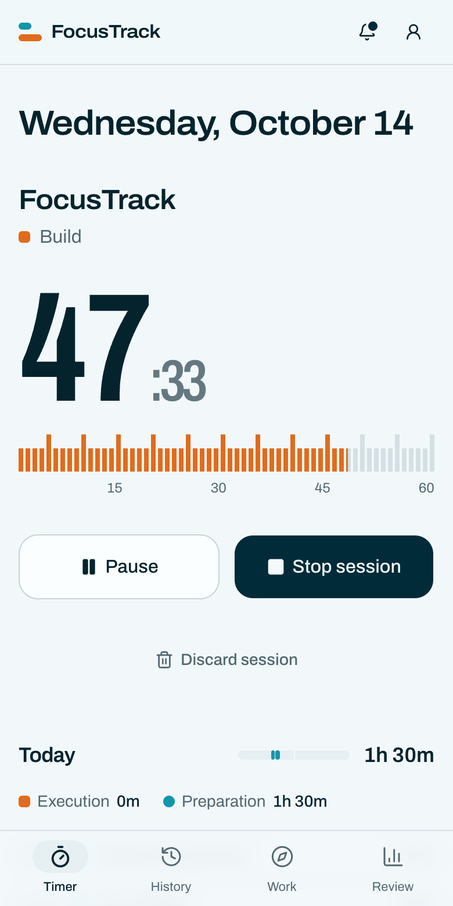
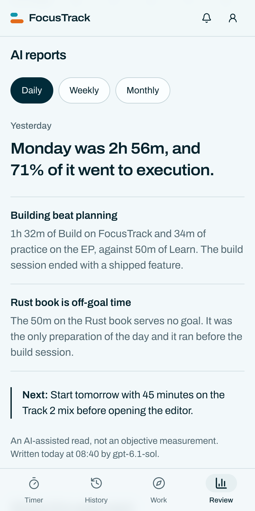

# FocusTrack

A personal work tracker that answers one question:

> Am I using my time well, and am I turning my thinking into meaningful execution?

It tracks work sessions and what each one produced. It is not a todo app, a habit tracker, or a journal.

**[Open the app](https://focustrack.sailab.dev/)**

<p align="center">
  
</p>

## What it does

- **Timer.** Pick a project and a category, start, pause, stop.
- **Session log.** Every session records what you worked on and what it produced.
- **Execution vs preparation.** Each category is one or the other, so every day, week, and project shows how much went to building and how much to getting ready to build.
- **Work.** Goals, the projects that serve them, and where the last four weeks actually went, including time on projects that serve no goal.
- **Review.** Five weeks side by side, plus daily, weekly, and monthly AI reports that cite your own numbers and end with one next action.
- **Nudges.** Computed from your own sessions and shown only in the app: take a break, still paused, pick a lapsed project back up.

AI is optional. Reports are written automatically the first time you open the app after a period ends. Without an API key, everything else works and reports are shown as off.

### Timer

<picture>
  <source media="(prefers-color-scheme: dark)" srcset="docs/screenshots/timer-dark.png">
  
</picture>

### History and Work

| History | Work |
|---|---|
|  |  |

### Review

| Five weeks | Weekly AI report |
|---|---|
|  |  |

### On a phone

<p align="center">
  
  &nbsp;&nbsp;
  
</p>

<sub>Screenshots show demo data.</sub>

## Stack

Next.js (App Router), TypeScript, Tailwind CSS, shadcn/ui, Supabase (Postgres, Auth, Row Level Security), deployed on Vercel.

## Run locally

Needs Node 24, pnpm, and Docker.

```bash
# Database: starts local Supabase and prints the API URL and publishable key
cd backend
pnpm install
pnpm start

# App
cd ../frontend
pnpm install
cp .env.example .env.local   # fill in the URL and key from above
pnpm dev                     # http://localhost:3000
```

Set `OPENAI_API_KEY` in `.env.local` to turn on AI reports.

## Test

```bash
cd frontend && pnpm test   # unit tests
cd backend && pnpm test    # database and RLS tests
```

## Deploy

Pushing to `main` runs [the deploy workflow](.github/workflows/deploy.yml): typecheck, lint, tests, then a production deploy to Vercel. Database migrations are applied separately with `pnpm db:push` from `backend/`.

## More

- [PLAN.md](PLAN.md): product spec and build plan
- [CLAUDE.md](CLAUDE.md): architecture, conventions, and working rules
